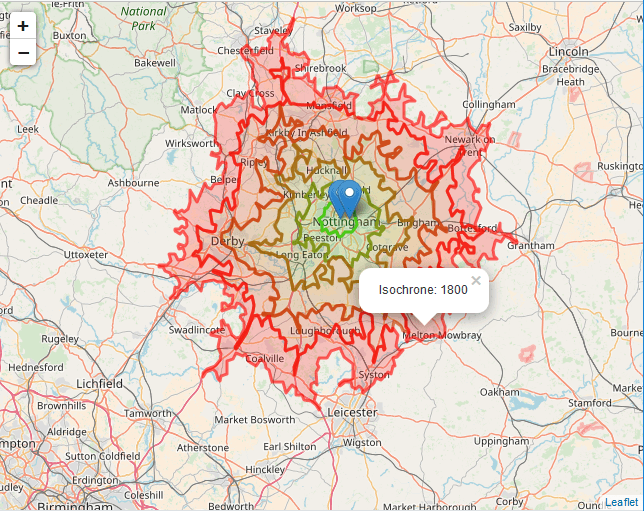

For those who'd like to skip the chit-chat:
**[Source code](mongo://foobar.org)**
**[Demo](mongo://foobar.org)**

## Background:
My fiance Kate and I have been trying to decide where to live. I'm just entering the workforce and I want to have access to cool tech jobs, but we also want access to cheap land to build a big garden, and we'd also like to stay close to our parents.
So, I made a tool to assess "commutability" of jobs from various locations!

## Implementation: 
talky talky talk I used foobar.js and quxxBase to build the backend and I used BazUI and Prometheus-router to build the frontend and my package.json has more dependencies than I have brain cells etc. etc...

## Takeaways:
I learned how to love, and also how to make wattle-and-daub houses.